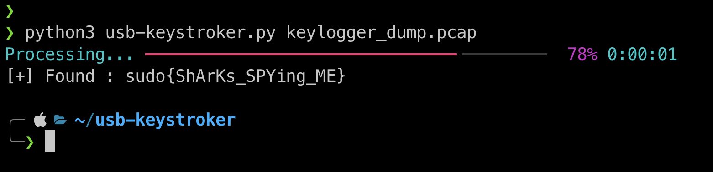

# usb-keystroker
a tool to solve USB Keystrokes from pcaps [for CTFs]
### Usage
```bash
$ git clone https://github.com/Rajchowdhury420/usb-keystroker
$ pip3 install -r requirements.txt
$ python3 usb-keystroker.py file.pcap
```


